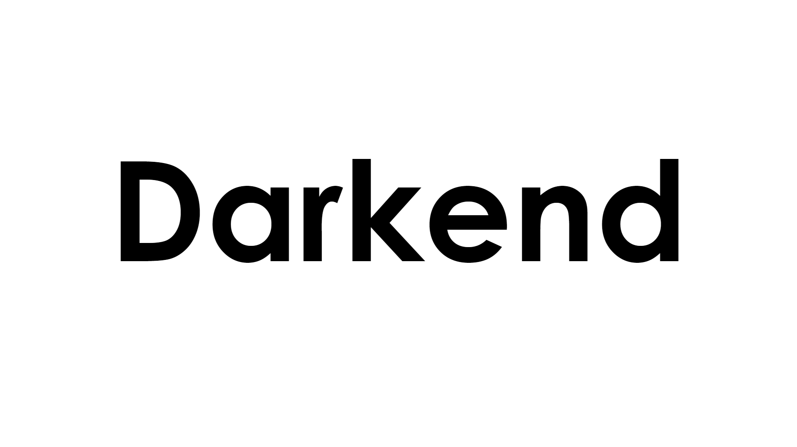

### 
 A feature rich software with all the services you need to make Dank memer devs cry.

# **NEW!**
- Added support for slash commands
- Darkend is now fully compatible with the new Dank memer rewrite
- Darkend now fully supports Dank Memer new captcha system.
- Added `Command delay`. A new feature to imitate being human and manually typing commands.
- `Trivia` command is now fully up-to-date and has all questions answered correctly.
# Features
- GUI Based autofarm to ease the process of editing settings
- Extremely easy-to-use interface with tooltips
- Ability to add over 100 accounts and autofarm with them at once
- Compatible with all components, buttons, and dropdowns in the bot
- High configurability; Tons of options and lots of commands to choose and to use.
- Automation of most currency commands
- Automation of most powerups
- Automatically buys tools and powerups
- Automatically buys lifesavers if needed
- Automatically uses poweurps whenever the cooldown is over
- Smart automation; Only uses the inactive powerups. Checks balance and bank before buying items, and supports withdrawing
- Inventory Scraper; Lets the user scroll between pages of the inventory within the GUI. Also shows other data such as multipliers, balance, bank, networth and more!
- Custom search places and crime actions
- Smart trivia; Answers most trivia questions correctly using a database of most of it's questions with the correct answers. Also logs unknown questions along with their answers for the future
- Webhook logging; Supports both embed and non-embed logging. Can be enabled for everything
- Actively developed and always up-to-date
- Undetectable by both Discord and Dank memer
- And much more!

# Getting Started

## Installation
1. Download the official release from the [the official website](http://darkend.tech/) or the [direct link](http://darkend.tech/Darkend.zip).
2. Extract the zip file.
3. Open the application.
### Windows
4. Double click `Darkend.exe`.
   - Only supports windows 8 and higher.

### Linux
- Support will be added at a later date.

### MacOS
- Will never be supported.
  
## Getting an authorization token
1. Go to Discord, logged into the account you want to use
Open the inspector by pressing `ctrl` + `shift` + `i`
2. Click the "network" tab
3. Refresh the page
4. Look for any entry called "science" and click on it
5. Expand the "request headers" and look for the value "authorization", that is your token
  
## Enabling Discord's developer mode
In order to start autofarming, a channel ID is required.
1. Go to your user settings on Discord
2. Click "Advanced" under "app settings"
3. Enable Developer mode
  
# Disclaimers
1. Here at Darkend we do **not** believe in manually editing the configuration files of the accounts.
    - If you face any issue/bug after manually editing the files, you will **not** be assisted.
  
2. While Darkend is safe, it is still a use-on-your-own-risk application.
    - No account was disabled while using Darkend, but **nothing** can be 100% safe.
  
3. Shifts are not added **yet**.
    - I advice you autofarm for less than 5 hours before taking a break for a few hours so you don't get banned.
  
# Got questions? [Join our discord](https://discord.gg/PkNNa8DtBd)